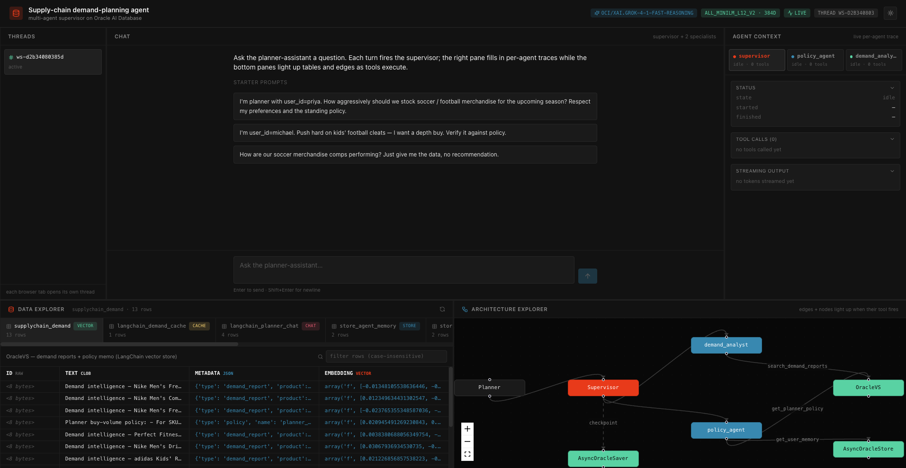
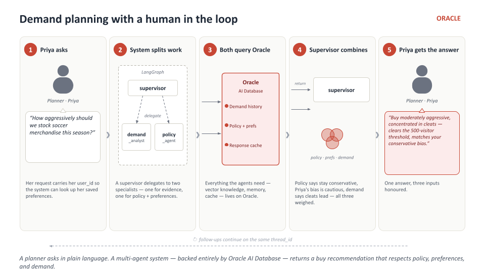
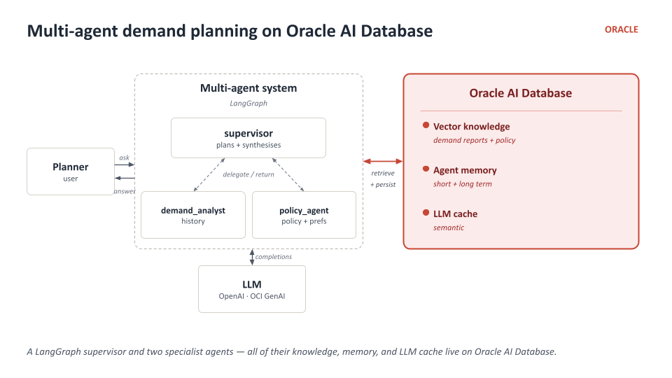
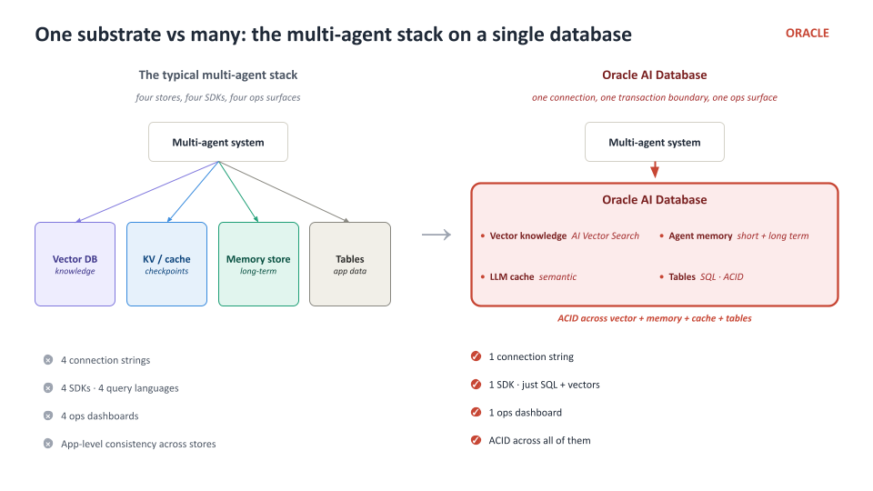
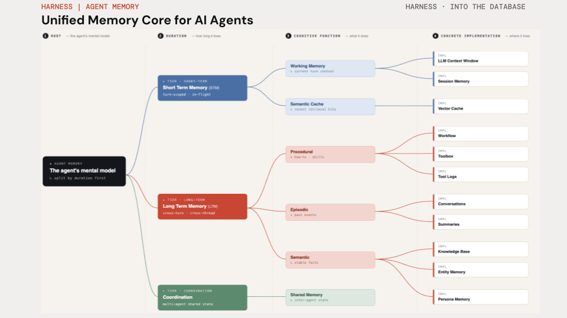
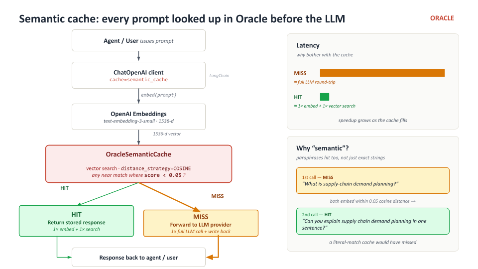
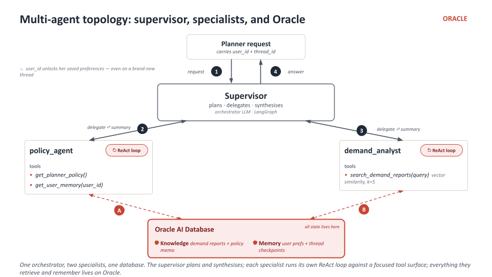
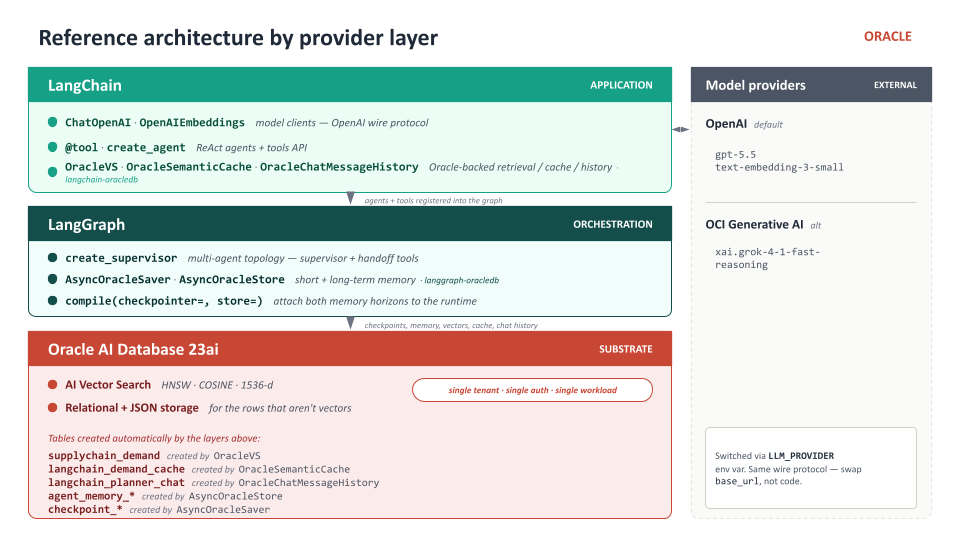

# Supply-Chain Demand Planning Agent Workshop

**Build a multi-agent demand-planning assistant on Oracle AI Database — every memory layer, every retrieval primitive, every LLM call traced back to one database. Then see it running in a real chat UI.**



A planner asks a question in plain language. A LangGraph supervisor decomposes the request and delegates to two specialists — `demand_analyst` (vector search over historical demand reports) and `policy_agent` (planner preferences + standing buy-volume policy) — then synthesises a buy recommendation that respects both the policy and the active planner's saved preferences. The UI shows the chat, a live per-agent trace, the rows backing every tool call, and an animated topology that lights up as tools fire.



---

## What you will build (and run)

This workshop is two halves of the same thing:

1. **The notebook** (`workshop/notebook_student.ipynb`) — you build a supervisor-coordinated multi-agent system from primitives:
   - In-database ONNX embeddings (`ALL_MINILM_L12_V2`, 384-dim) — no external embedding API.
   - `OracleVS` vector knowledge base of historical product demand reports + a standing buy-volume policy.
   - `AsyncOracleStore` long-term, cross-thread memory for per-planner saved preferences.
   - `AsyncOracleSaver` per-thread checkpoint state.
   - `OracleSemanticCache` LLM-response cache (demoed standalone).
   - Two specialist agents (`demand_analyst`, `policy_agent`) compiled with `langchain.agents.create_agent`.
   - A `langgraph_supervisor` supervisor that decomposes planner requests, delegates to specialists, and synthesises a buy recommendation that respects both the standing policy and the active planner's saved preferences.
   - **9 focused coding TODOs across 12 parts**, ~60–75 minutes.

2. **The app** (`app/`) — a reference deployment of the _same_ multi-agent system against the _same_ Oracle. Chat pane on the left, per-agent context pane on the right showing what each specialist saw and produced, real-time architecture explorer at the bottom showing tool calls and hand-offs as they happen.

> The whole supervisor + 2 specialists loop is roughly 150 lines of Python; the rest is database primitives.

## Architecture at a glance



A LangGraph supervisor and two specialist agents — all of their knowledge, memory, and LLM cache live on Oracle AI Database. No second store, no second connection string, no second consistency model.



## Provider-neutral LLM

The chat model is provider-aware via `LLM_PROVIDER`. Both endpoints speak the OpenAI wire protocol, so the same `ChatOpenAI` client works in both modes:

| `LLM_PROVIDER`  | What it means                                                     | Required env vars                                                                                                              |
| --------------- | ----------------------------------------------------------------- | ------------------------------------------------------------------------------------------------------------------------------ |
| `oci` (default) | Point the OpenAI client at OCI GenAI's OpenAI-compatible endpoint | `OCI_GENAI_API_KEY`, `OCI_GENAI_ENDPOINT` (defaulted to Phoenix), optional `LLM_MODEL` (default `xai.grok-4-1-fast-reasoning`) |
| `openai`        | Call OpenAI directly                                              | `OPENAI_API_KEY`, optional `LLM_MODEL` (default `gpt-5.5`)                                                                     |

Embeddings are **always in-database** (Oracle ONNX) — no external embedding key required.

## Workshop parts

| Part | Topic                                                       | Guide                                                                | Coding TODO? |
| ---- | ----------------------------------------------------------- | -------------------------------------------------------------------- | ------------ |
| 1    | Setup & connectivity                                        | [docs/part-1-setup.md](docs/part-1-setup.md)                         | —            |
| 2    | In-DB embeddings (`OracleEmbeddings` + `ALL_MINILM_L12_V2`) | [docs/part-2-embeddings.md](docs/part-2-embeddings.md)               | **TODO 1**   |
| 3    | `OracleVS` — vector knowledge base                          | [docs/part-3-vector-store.md](docs/part-3-vector-store.md)           | **TODO 2**   |
| 4    | `AsyncOracleStore` — long-term cross-thread memory          | [docs/part-4-store.md](docs/part-4-store.md)                         | **TODO 3**   |
| 5    | `AsyncOracleSaver` — per-thread checkpoints                 | [docs/part-5-saver.md](docs/part-5-saver.md)                         | **TODO 4**   |
| 6    | `OracleSemanticCache`                                       | [docs/part-6-cache.md](docs/part-6-cache.md)                         | **TODO 5**   |
| 7    | Naive substring vs semantic vector search                   | [docs/part-7-search-comparison.md](docs/part-7-search-comparison.md) | **TODO 6**   |
| 8    | `demand_analyst` specialist                                 | [docs/part-8-demand-analyst.md](docs/part-8-demand-analyst.md)       | **TODO 7**   |
| 9    | `policy_agent` specialist                                   | [docs/part-9-policy-agent.md](docs/part-9-policy-agent.md)           | **TODO 8**   |
| 10   | Supervisor + end-to-end invocation                          | [docs/part-10-supervisor.md](docs/part-10-supervisor.md)             | **TODO 9**   |
| 11   | `OracleChatMessageHistory` standalone                       | [docs/part-11-chat-history.md](docs/part-11-chat-history.md)         | —            |
| 12   | Teardown                                                    | —                                                                    | —            |

> **[TODO checklist](docs/TODO-checklist.md)** — 9 coding TODOs at a glance, each with a hard-stop assert checkpoint.
>
> **[Troubleshooting](docs/troubleshooting.md)** — common failures and fixes.

## Notebook pair

| Notebook                                                               | When to open                                                                                                   |
| ---------------------------------------------------------------------- | -------------------------------------------------------------------------------------------------------------- |
| [`workshop/notebook_student.ipynb`](workshop/notebook_student.ipynb)   | Your working notebook — 9 blank-stub TODOs + hard-stop asserts that fail loudly until you implement            |
| [`workshop/notebook_complete.ipynb`](workshop/notebook_complete.ipynb) | The same 12-part notebook with all 9 TODOs filled in — open when stuck, or as a reference once you've finished |

## Getting started

This workshop lives inside the [oracle-ai-developer-hub](https://github.com/oracle-devrel/oracle-ai-developer-hub) repository. Use **git sparse-checkout** to pull just this workshop without cloning the rest of the hub:

```bash
# Clone the hub with no files and no blobs
git clone --filter=blob:none --no-checkout https://github.com/oracle-devrel/oracle-ai-developer-hub.git
cd oracle-ai-developer-hub

# Enable sparse-checkout and select only this workshop
git sparse-checkout init --cone
git sparse-checkout set workshops/supplychain_demand_agent_workshop

# Materialise the files and move into the workshop
git checkout main
cd workshops/supplychain_demand_agent_workshop
```

You will need: Python 3.11+, Node 20+, Docker (or Podman), and an OCI Generative AI key (or OpenAI key).

```bash
# 1. Bring Oracle up (~3-5 min on first run).
docker compose -f .devcontainer/docker-compose.yml up -d oracle-free
docker compose -f .devcontainer/docker-compose.yml logs -f oracle-free | grep -m1 "DATABASE IS READY TO USE"

# 2. Python deps for setup + backend.
pip install -r app/backend/requirements.txt
pip install jupyter datasets

# 3. Set provider credentials.
export LLM_PROVIDER=oci
export OCI_GENAI_API_KEY=sk-...
export OCI_GENAI_ENDPOINT=https://inference.generativeai.us-phoenix-1.oci.oraclecloud.com
# (or LLM_PROVIDER=openai + OPENAI_API_KEY=sk-...)

# 4. One-time setup — creates AGENT user, loads the ONNX embedder, seeds the data.
python app/scripts/bootstrap.py
python app/scripts/onnx_setup.py
python app/scripts/seed_supplychain.py

# 5. Open the workshop notebook.
jupyter lab workshop/notebook_student.ipynb

# 6. (Optional) Start the chat app to see your wired pieces run live.
python -m uvicorn app.backend.main:app --host 0.0.0.0 --port 8000 &
cd app/frontend && npm install && npm run dev -- --host 0.0.0.0 --port 3000
```

Open the notebook and work through TODOs 1–9. Each has a hard-stop assert below it that fails until your implementation is correct. Then open <http://localhost:3000> to see the same primitives wired up as a chat app.

## Repository layout

```
workshops/supplychain_demand_agent_workshop/
├── README.md                          ← you are here
├── .devcontainer/                     ← Oracle compose + (optional) devcontainer infra
├── images/                            ← architecture diagrams + app screenshot
├── app/
│   ├── scripts/
│   │   ├── bootstrap.py                   AGENT user + vector memory pool
│   │   ├── onnx_setup.py                  downloads + loads the ONNX embedder
│   │   └── seed_supplychain.py            Hugging Face dataset → OracleVS + AsyncOracleStore
│   ├── backend/                       FastAPI + WebSocket supervisor streaming
│   └── frontend/                      React + Vite + Tailwind chat UI
├── workshop/
│   ├── notebook_student.ipynb         ← 9 blank-stub TODOs + hard-stop checkpoints
│   └── notebook_complete.ipynb        ← solutions filled in
└── docs/                              per-part guides + TODO checklist + troubleshooting
```

## Memory taxonomy



Agent memory splits first by **duration** (short-term vs long-term vs coordination), then by **cognitive function** (working, episodic, procedural, semantic, persona). The two memory primitives in this workshop cover the two horizons: `AsyncOracleSaver` is the short-term / per-thread tier, `AsyncOracleStore` is the long-term / cross-thread tier. Both live on Oracle AI Database.

### Semantic cache



Traditional caches key by the literal request — two prompts asking the same thing in different words both miss. `OracleSemanticCache` keys by the embedding of the prompt, so paraphrases, capitalisation drift, and punctuation all collapse to the same cached response.

### Multi-agent topology



The supervisor plans and synthesises; each specialist runs its own ReAct loop against a focused tool surface; every retrieval path ends in Oracle.

### Provider layers



LangChain owns the application layer (model clients, tools, retrieval/cache/history). LangGraph owns the orchestration layer (supervisor, checkpointer, store). Oracle AI Database owns the substrate (vectors, JSON, relational, all ACID).

## Related material in this hub

- [`workshops/enterprise-data-agent-harness-workshop`](../enterprise-data-agent-harness-workshop) — the same kind of memory-aware agent pattern applied to an enterprise data harness
- [`notebooks/memory_context_engineering_agents.ipynb`](../../notebooks/memory_context_engineering_agents.ipynb) — the six types of persistent memory for AI agents
- [`notebooks/oracle_agentic_rag_hybrid_search.ipynb`](../../notebooks/oracle_agentic_rag_hybrid_search.ipynb) — vector + keyword + hybrid search in a single SQL query
